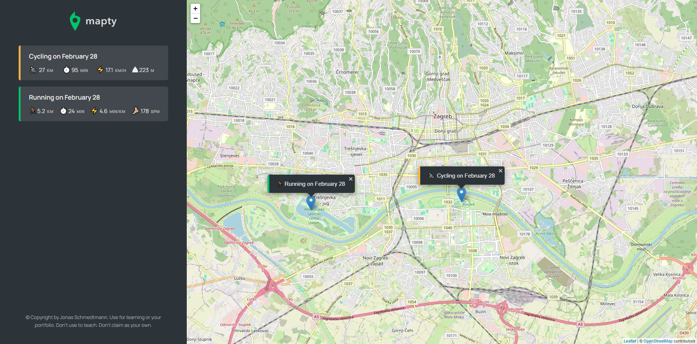

# Mapty Project - Udemy JavaScript Course

## Description

This repository contains the Mapty project developed as part of [The Complete JavaScript Course 2024: From Zero to Expert!](https://www.udemy.com/course/the-complete-javascript-course/) course on Udemy. Mapty is a web application for tracking fitness activities, allowing users to record various types of workouts on an interactive map.

## Features

- Activity Tracking: Users can add new activities to the map, such as running or cycling.
- Interactive Map: Activities are displayed on an interactive map using the Google Maps API.
- Detailed View: Each activity includes information such as activity type, distance, duration, and speed.
- Data Storage: Entered activity data is stored locally using the web browser.

## Technologies Used

- HTML5 and CSS3 for the user interface.
- JavaScript for the application's logic.
- Leaflet for displaying the map.
- The project follows modern JavaScript practices and principles, including ES6 features.

## Getting Started

To run the Mapty project, clone this repository to your local machine and open the `index.html` file in your web browser.

## Project Structure

The project has a simple structure:

- `index.html`: The main HTML file for the project.
- `css/style.css`: The CSS file for styling the user interface.
- `js/script.js`: The main JavaScript file containing the application logic.
- `img`: A directory containing images used in the project.

## Credits

The Mapty project was created as part of [The Complete JavaScript Course 2024: From Zero to Expert!](https://www.udemy.com/course/the-complete-javascript-course/) on Udemy, instructed by [Jonas Schmedtmann](https://www.udemy.com/user/jonasschmedtmann/). The design, code, and concepts are based on the course content.
